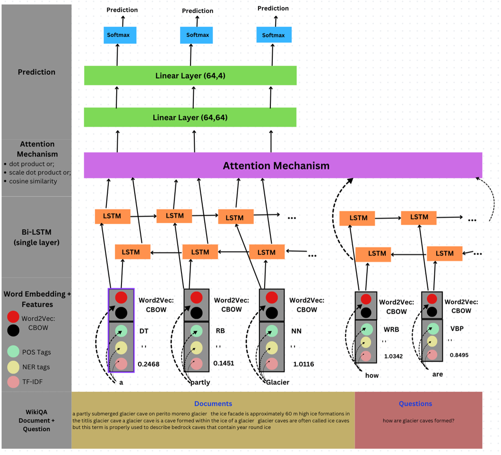

# CITS 4012 - Natural Language Processing (Group 42)
Github Repository: https://github.com/danieltobiastan/nlp43/tree/master
## Members: 
- Daniel Tan (22684196)
- Finn Murphy (2223789)
- Nicholas Choong (21980614)
- Tom Walker (21979744)

## Overview:
This project aims to create a Question Answering (QA) Model based on data from the Microsoft QA Corpus. For the purposes of this assignment however, we used a reduced dataset, already split into training and test sets that can be found in the zip file submitted, and also on the Github Repository itself as "WikiQA-train.tsv" and "WikiQA-test.tsv".

The goal is to create a model that can answer questions accurately given the relevant document, where the answer is a span of text from the document. The model will then be trained to pick out the "Start", "Inner", "End" and "Not Answer" words from the document, and then use these to predict the answer to the question. The metric that we will use to evaulate the models will be the precision, recall and F1 scores. Accuracy will not be used, as it is not a good metric for this task, as there is a large class imbalance between the "Not Answer" class and the other classes.

Prior to training the models, we are required to preprocess the data, which will be explained in the next section.

## Data:
The data that we will be using is the WikiQA dataset, which is a dataset of questions and answers from Wikipedia. The dataset is split into a training and test set, which can be found in the zip file submitted, and also on the Github Repository itself as "WikiQA-train.tsv" and "WikiQA-test.tsv". The data is in the form of a tab-separated file, where each row contains the following information:
- Question ID
- Question
- Document ID
- Document Title
- Sentence ID
- Sentence
- Label

The label is a binary value, where 1 indicates that the sentence is the correct answer to the question, and 0 indicates that the sentence is not the correct answer to the question. The sentences corresponding to their respective documents are then combined into a single document, and the question is then used to find the answer to the question in the document. The answer is then a span of text from the document. For questions that do not have an answer in the document, the answer is then a span of text from the document that is not the answer to the question. This is then labelled as "Not Answer". Then, if the question have more than one answer in the document, the answer is then the first answer that is found. 

## Data Wrangling:
The data is preprocessed on both the training and test sets. The preprocessing steps are as follows:
1. Remove all punctuation from the questions and documents
2. Convert all words to lowercase
3. Convert all contraction words to their full form (e.g. "I'm" to "I am")

Once the data has been preprocessed, the nltk function (word_tokenize) to tokenize each word in each document and their corresponding question. Each word token in the document is then given a label, which is either "Start", "Inner", "End" or "Not Answer". The label is then used to train the model to predict the answer to the question. 
More in-depth information about the data preprocessing steps can be found in the report submitted.

## Input Embeddings:
To represent the words in both the documents and question, we will use a continuous bag of words (CBOW) model to create word embeddings. In this case we use a 100 dimension word embedding to represent the word. In addition to the CBOW, we include part of speech (POS) tags, named entity recognition (NER) tags and TF-TDF scores. This gives the model more information and context about the word, and allows the model to better predict the answer to the question.

## Model:
We adopt a Bi-Directional Long Short Term Memory (Bi-LSTM) recurrant neural network (RNN) model to predict the answer to the question. The model is trained on the training set, and then evaluated on the test set. The model is then trained to predict the label of each word token in the document. The model is trained using the AdamW optimizer, and the loss function used is the categorical cross-entropy loss function. The model is trained for 10 epochs, and the model with the best validation accuracy is then used to predict the answer to the question. The model is then evaluated using the precision, recall and F1 scores.

A snapshot of the model architecture can be found below:

## Study:
In the report submitted, we have included a study of the model, where we have tested the model on different hyperparameters, and also different input embeddings. The results of the study can be found in the report submitted.

## How to run the code:
To run the model, you will need to have the following libraries installed:
- numpy
- pandas
- nltk
- sklearn
- torch
- optuna
- tabulate
- seaborn
- matplotlib
- gensim
- spacy
- en_core_web_sm

The data wrangling model notebook can be found in the repository. To run the notebook, you will need to have the data in the same directory as the notebooks. The data can be found in the zip file submitted, and also on the Github Repository itself as "WikiQA-train.tsv" and "WikiQA-test.tsv". Additionally, the pre-trained models can also found and called in the notebook. This applies for both the preprocessing tools like CBOW and the Bi-LSTM models. 

**Important Note: Please ensure that there is an additional directory called "<i>cleaneddata</i>" in your working directory to store the processed data in your directory in case the kernel dies**
